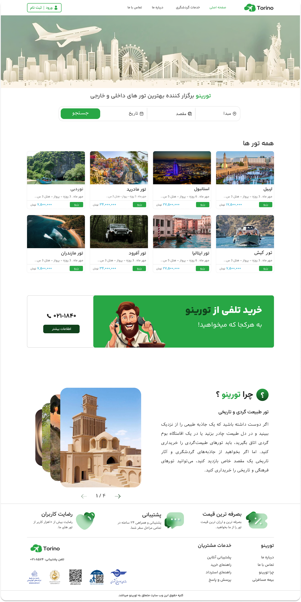
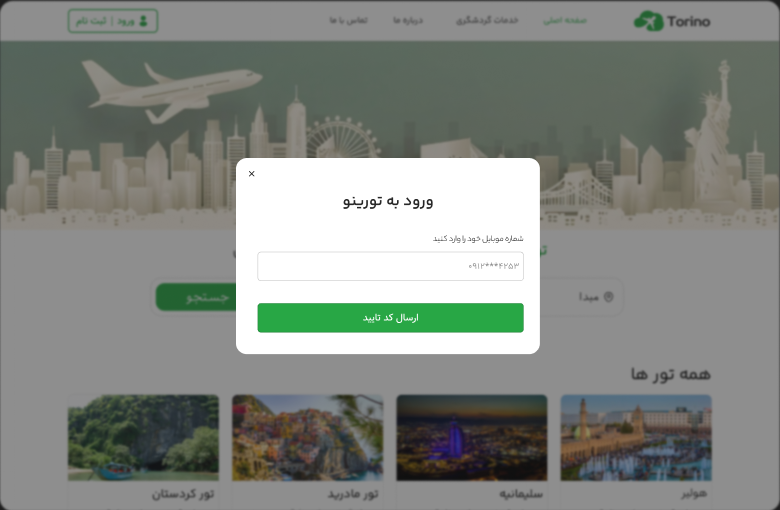
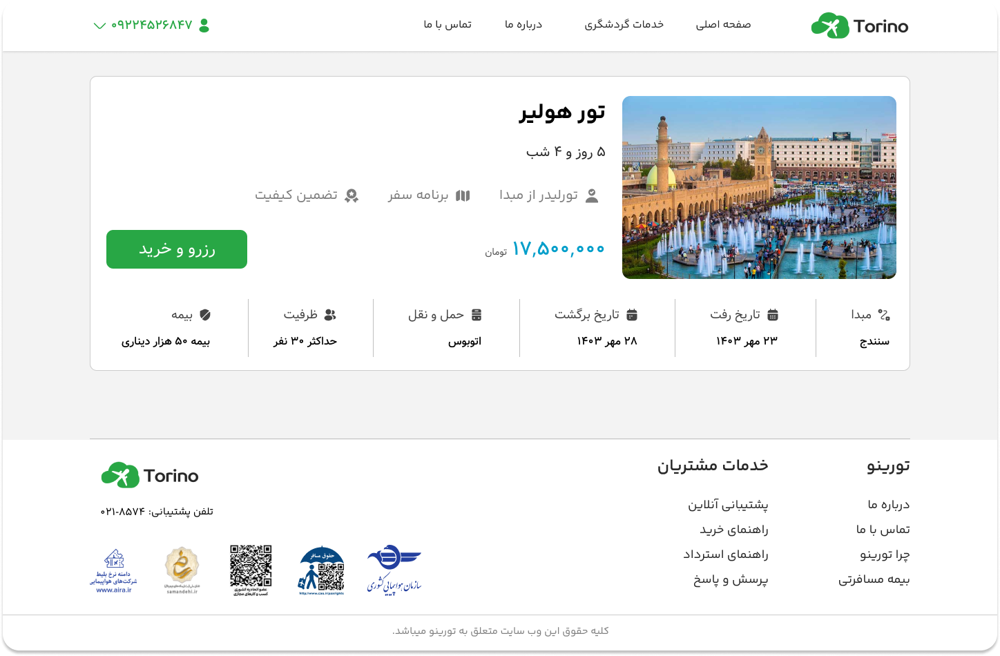
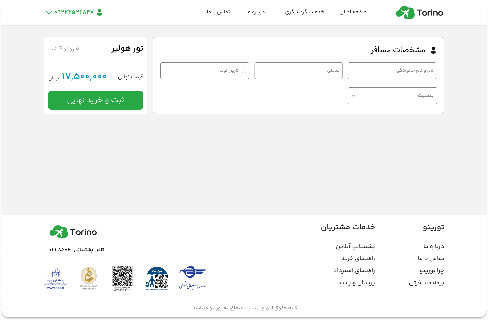
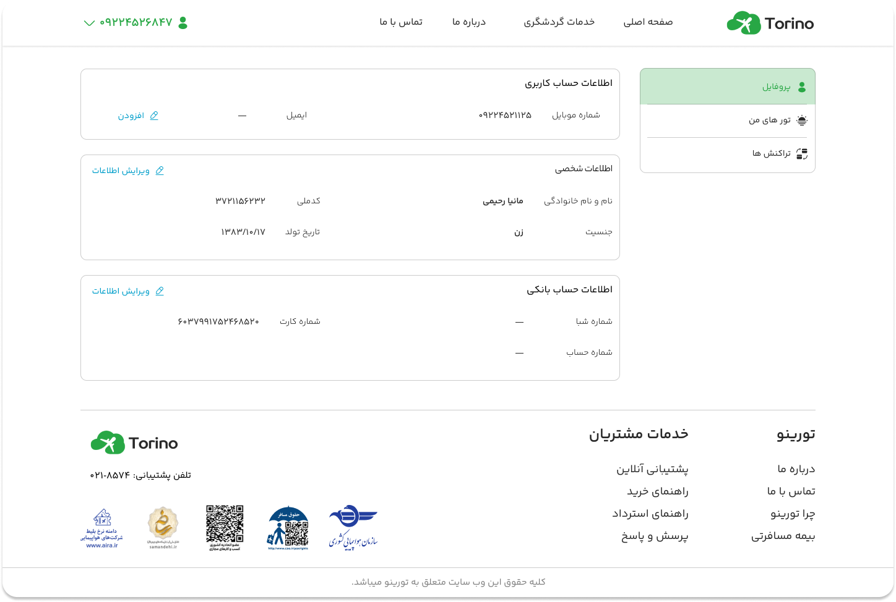

# Torino Web 
Torino Web is a modern **Next.js (App Router)** tourism and tour booking platform for exploring and reserving the best domestic and international tours.

The project is designed as a monorepo and includes both the frontend and backend applications:

- torino-web — Frontend application
- torino-api — Backend API

The application includes an OTP-based authentication system, protected user dashboard pages, tour reservation flow, and secure token handling using HttpOnly cookies.

Built with a clean service layer, form validation, and **React Query** for optimized fetching and caching.

## 🔧 Tech Stack

Frontend
- **Next.js 16.2.9** (App Router)
- **React 19.2.4**
- **TanStack React Query v5** (+ Devtools)
- **Axios**
- **React Hook Form** + **Yup**
- **OTP Login** (react-otp-input)
- **Swiper** (sliders/carousels)
- **react-hot-toast** (notifications)
- **zaman** (date utilities)
- **ESLint**
- **CSS Modules**

Backend
- **Node.js** & **Express.js**
- **Mongoose** (MongoDB ODM)
- **JSON Web** Tokens (JWT) 
- **Swagger UI** 
- **CORS & Dotenv**

## ✨ Features

- Browse the best domestic and international tours
- View detailed information for each tour
- Reserve tours through a booking flow
- Complete the reservation process through checkout
- View payment result/status after payment
- OTP-based user authentication
- Secure token handling with HttpOnly cookies
- Protected dashboard pages for authenticated users
- User account information management
- View booked/registered tours
- View user transactions
- Smart data fetching and caching with React Query
- Responsive and modern UI
- SEO-ready structure with Next.js App Router
- Persian (Farsi) RTL user interface

## 📄 Pages / Sections
- Home page
- Public information / site guide page
- Tour details and reservation page
- Checkout page
- Payment status page
- Protected dashboard pages:
    - User account information
    - User transactions
    - User booked tours
- 404 page and server error section

## 🔐 Authentication & Security
- Authentication is implemented using an OTP login flow
- Users log in with their phone number and verification code
- The application uses:
    - accessToken
    - refreshToken
- Both tokens are stored as HttpOnly cookies for better security
- Protected pages in the dashboard are accessible only to authenticated users


## 📁 Project Structure
Monorepo Structure 
```bash
Torino-website/
├─ torino-web/       # Frontend application
├─ torino-api/       # Backend API
└─ README.md
```
torino-web
```bash
├─ public/
├─ src/
│ ├─ app/ # Next.js App Router routes (pages/layouts)
│ ├─ components/ # UI components (Header, Modal, Cards, …)
│ ├─ services/ # API services (axios-based)
│ ├─ providers/ # React Query Provider
│ ├─ schema/ # Yup schemas for forms
│ ├─ styles/ # CSS Modules
│ └─ utils/ # Helpers 
├─ package.json
├─ jsconfig.json
├─ ...
└─ README.md 
```
## 🚀 Getting Started

### 1. Environment Setup
Before running the project, you need to set up your environment variables:

- Go to the torino-web directory.
- Create a .env.local file based on .env.example if needed.
- Set the API base URL to your local or production backend address.
- Use this backend address for local development: http://localhost:6500/

### 2. Installation & Run
To get the project up and running, follow these steps:

Frontend (App):

- cd torino-web
- npm install
- npm run dev
- App will run at: http://localhost:3000

Backend (API):

- cd torino-api
- npm install
- npm start
- API will run at: http://localhost:6500/

## 💳 Payment Flow Note
The payment flow in this project is simulated for demo/practice purposes.
- After the checkout step, the user is redirected to a payment status page
- After a few seconds, a mock success payment result is shown
- No real payment gateway is connected in the current version

## 📸 Screenshots

<p align="center">
    
</p>

<p align="center">
    
    
    
    
</p>

## 🤝 Acknowledgments
Special thanks to **Milad Azami** for providing the custom API and guidance for this project.

- **GitHub:** [@milad-azami](https://github.com/milad-azami)